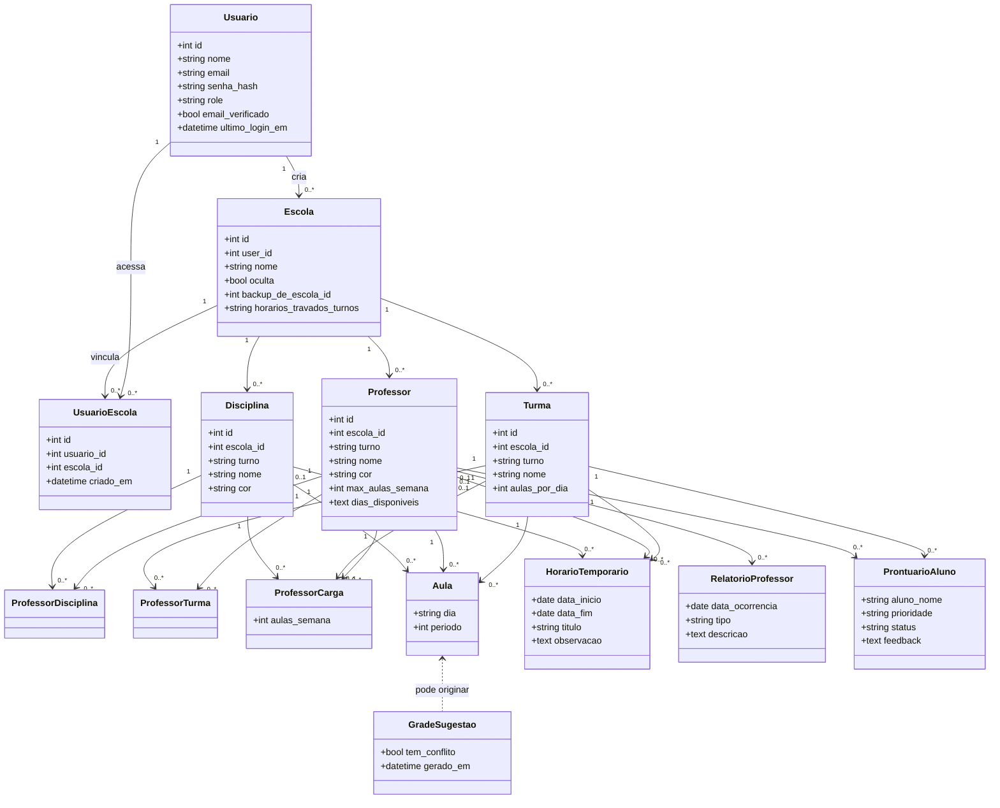
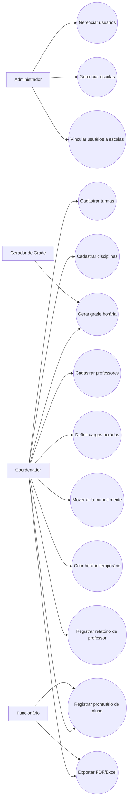
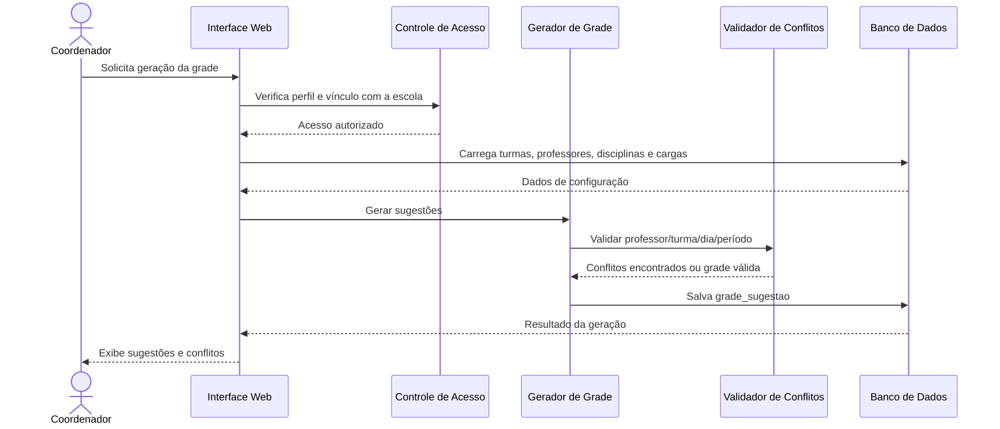
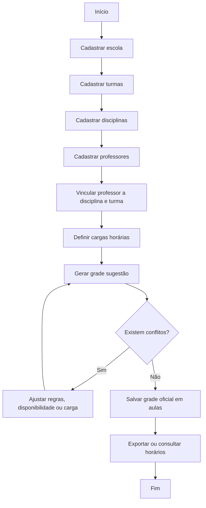

# Flowter - Documentação Técnica do Software com Modelagem UML

**Sistema:** Flowter - Sistema de Gestão Escolar e Geração de Horários  
**Tipo:** Aplicação web  
**Tecnologias:** Python, Flask, MySQL/MariaDB, HTML, CSS e JavaScript  
**Versão da documentação:** 1.0 - revisada e aprimorada  
**Data:** 08/06/2026

---

## Sumário executivo

O Flowter é uma aplicação web voltada para escolas que precisam organizar turmas, professores, disciplinas e horários com menor risco de conflito. O sistema centraliza os cadastros escolares, registra vínculos e cargas horárias, gera sugestões de grade, permite ajustes manuais, mantém horários temporários e oferece módulos de relatório e prontuário.

Esta versão da documentação melhora o material existente, confere os dados do diagrama enviado e reorganiza o modelo em uma visão UML mais clara, pronta para evolução técnica e apresentação acadêmica/profissional.

---

## 1. TAP - Termo de Abertura do Projeto

### 1.1 Identificação do projeto

| Campo | Descrição |
|---|---|
| Nome do projeto | Flowter - Sistema de Gestão Escolar |
| Tipo de sistema | Aplicação web |
| Área de negócio | Gestão escolar e organização de horários |
| Tecnologias principais | Python, Flask, MySQL/MariaDB, HTML, CSS e JavaScript |
| Repositório | Proj--Gestao-Escolar |

### 1.2 Justificativa

Instituições escolares precisam organizar horários de forma consistente. O processo manual costuma gerar conflitos, como professor em duas turmas no mesmo período, excesso de aulas seguidas, falta de controle de disponibilidade e baixa rastreabilidade das alterações.

O Flowter foi desenvolvido para centralizar esses cadastros, automatizar parte da geração da grade horária e facilitar a consulta, exportação e acompanhamento das informações escolares.

### 1.3 Objetivo geral

Desenvolver uma aplicação web para auxiliar escolas na gestão de usuários, escolas, turmas, disciplinas, professores, cargas horárias, horários oficiais, horários temporários, relatórios de professores e prontuários de alunos.

### 1.4 Objetivos específicos

- Permitir cadastro, login, verificação de e-mail e recuperação de senha.
- Controlar perfis de acesso: administrador, coordenador e funcionário.
- Permitir vínculo de usuários com escolas.
- Gerenciar escolas, turmas, disciplinas e professores.
- Registrar cargas horárias por professor, turma e disciplina.
- Gerar horários escolares respeitando regras de conflito.
- Permitir criação, movimentação e remoção manual de aulas.
- Permitir horários temporários sem alterar a grade oficial.
- Registrar relatórios de professores e prontuários de alunos.
- Exportar horários e relatórios em PDF e Excel.
- Manter backups ocultos de escolas para restauração administrativa.

---

## 2. Atores e perfis de acesso

| Ator | Responsabilidade | Permissões esperadas |
|---|---|---|
| Administrador | Governa o sistema, usuários, escolas e backups. | Acesso total, criação de vínculos, restauração e gestão de perfis. |
| Coordenador | Opera a escola vinculada e organiza a grade. | CRUD escolar, geração de horários, relatórios e prontuários. |
| Funcionário | Consulta e exporta informações autorizadas. | Visualização, exportação e acompanhamento conforme vínculo. |
| Sistema Gerador de Grade | Aplica regras e sugere alocações. | Executa validações de conflito e grava sugestões/aulas. |
| Equipe escolar | Consome horários e relatórios. | Consulta indireta por exportações e telas autorizadas. |

---

## 3. Requisitos funcionais

| Código | Requisito |
|---|---|
| RF01 | O sistema deve permitir cadastro e login de usuários. |
| RF02 | O sistema deve exigir verificação de e-mail antes do acesso. |
| RF03 | O sistema deve permitir recuperação e redefinição de senha. |
| RF04 | O sistema deve controlar permissões por perfil. |
| RF05 | O sistema deve permitir cadastro, edição e exclusão de escolas. |
| RF06 | O sistema deve permitir cadastro de turmas por turno. |
| RF07 | O sistema deve permitir cadastro de disciplinas por turno. |
| RF08 | O sistema deve permitir cadastro de professores, disponibilidade e cargas. |
| RF09 | O sistema deve gerar horários escolares oficiais. |
| RF10 | O sistema deve validar conflitos de professor, turma e disciplina. |
| RF11 | O sistema deve permitir mover aulas na grade. |
| RF12 | O sistema deve permitir horários temporários por período. |
| RF13 | O sistema deve permitir registro de relatórios de professores. |
| RF14 | O sistema deve permitir registro de prontuários de alunos. |
| RF15 | O sistema deve exportar horários e relatórios em PDF e Excel. |
| RF16 | O sistema deve permitir administração de usuários, vínculos e backups. |
| RF17 | O sistema deve permitir escolas ocultas como cópias de segurança administrativa. |
| RF18 | O sistema deve registrar rastreabilidade de criação, exclusão e feedback quando aplicável. |

---

## 4. Requisitos não funcionais

| Código | Requisito |
|---|---|
| RNF01 | O sistema deve ser executado em ambiente web. |
| RNF02 | O banco deve ser MySQL 8 ou MariaDB 10 ou superior. |
| RNF03 | As senhas devem ser armazenadas com hash, nunca em texto puro. |
| RNF04 | A sessão deve usar cookies HTTPOnly e políticas de segurança. |
| RNF05 | O sistema deve possuir proteção CSRF em requisições mutáveis. |
| RNF06 | A aplicação deve permitir configuração por variáveis de ambiente. |
| RNF07 | O código deve manter separação entre rotas, modelos, banco, serviços e exportações. |
| RNF08 | A aplicação deve suportar exportação de arquivos temporários. |
| RNF09 | O sistema deve possuir índices e restrições para evitar duplicidades críticas. |
| RNF10 | O sistema deve registrar criação, atualização e exclusão lógica onde houver histórico sensível. |

---

## 5. Modelo de dados conferido

Entidades identificadas no diagrama enviado:

| Entidade | Papel no domínio |
|---|---|
| usuarios | Usuários do sistema, autenticação, perfil e controle de login. |
| escolas | Unidades escolares, dono/vínculo, ocultação e backup. |
| usuarios_escolas | Associação entre usuários e escolas. |
| turmas | Turmas por escola, turno e quantidade de aulas por dia. |
| disciplinas | Disciplinas por escola e turno, com cor de exibição. |
| professores | Professores por escola e turno, com disponibilidade e limite semanal. |
| professores_disciplinas | Associação N:N entre professores e disciplinas. |
| professores_turmas | Associação N:N entre professores e turmas. |
| professores_cargas | Carga horária planejada por professor, turma e disciplina. |
| aulas | Grade oficial salva no sistema. |
| grade_sugestao | Sugestões geradas antes da confirmação da grade. |
| horarios_temporarios | Eventos/aulas temporárias por período de datas. |
| relatorios_professores | Ocorrências, faltas e registros de professores. |
| prontuarios_alunos | Registros de alunos, prioridades, status e feedback. |

---

## 6. UML - Diagrama de classes conceitual

---

## 7. UML - Casos de uso

---

## 8. UML - Sequência: geração de grade horária

---

## 9. UML - Atividade: cadastro até grade oficial

---

## 10. Arquitetura lógica recomendada

| Camada/Módulo | Responsabilidade |
|---|---|
| `src/app.py` | Inicialização do Flask, blueprints, segurança e criação/migração de tabelas. |
| `src/routes/` | Rotas HTTP, formulários, sessão, templates e orquestração de casos de uso. |
| `src/models/` | Regras de negócio e acesso a dados das entidades principais. |
| `src/database/` | Conexão, schema, migrações simples e scripts de inicialização. |
| `src/services/` | Serviços transversais: autenticação, e-mail, grade, permissões e backups. |
| `src/utils/` | Funções auxiliares, validações e checagem de conflitos. |
| `src/exports/` | Geração de PDF e Excel. |
| `src/templates/` e `src/static/` | Interface web, componentes visuais, CSS e JavaScript. |
| `tests/` | Testes automatizados de regras, rotas e persistência. |

---

## 11. Recomendações técnicas após conferência

| Ponto | Melhoria recomendada |
|---|---|
| Padronizar nomes | Usar nomes completos: `professores_cargas`, `professores_turmas`, `professores_disciplinas`, `horarios_temporarios` e `prontuarios_alunos`. |
| Criar restrições únicas | Evitar duplicidade em `usuarios.email`, `usuarios_escolas(usuario_id, escola_id)`, `turmas(escola_id, turno, nome)`, `disciplinas(escola_id, turno, nome)` e `aulas(escola_id, turno, turma_id, dia, periodo)`. |
| Rever duplicidade de disciplina do professor | A tabela `professores` possui `disciplina_id` e também existe `professores_disciplinas`. Definir se `disciplina_id` é disciplina principal ou remover para evitar inconsistência. |
| Formalizar turno | Transformar `turno` em enum validado ou tabela de domínio. |
| Auditar regras de conflito | Centralizar as regras em um serviço único para geração automática e movimentação manual. |
| Usar soft delete onde houver histórico | Relatórios e prontuários já possuem exclusão lógica. Avaliar o mesmo para escolas, turmas e professores se houver necessidade de auditoria. |
| Adicionar timestamps consistentes | Padronizar `criado_em`, `atualizado_em` e `excluido_em` onde fizer sentido. |
| Documentar cascatas | Definir `ON DELETE` e `ON UPDATE` para impedir dados órfãos. |
| Separar sugestão de oficial | Manter `grade_sugestao` como rascunho e `aulas` como grade oficial confirmada. |
| Backups de escola | Documentar claramente quando `backup_de_escola_id` aponta para escola original ou cópia oculta. |

---

## 12. Índices e restrições sugeridas

| Tabela | Índices/restrições sugeridos |
|---|---|
| usuarios | `UNIQUE(email)`, `INDEX(role)`, `INDEX(email_verificado)`. |
| usuarios_escolas | `UNIQUE(usuario_id, escola_id)`. |
| turmas | `UNIQUE(escola_id, turno, nome)`. |
| disciplinas | `UNIQUE(escola_id, turno, nome)`. |
| professores | `INDEX(escola_id, turno, nome)`, `INDEX(disciplina_id)`. |
| professores_cargas | `UNIQUE(professor_id, turma_id, disciplina_id)`. |
| aulas | `UNIQUE(escola_id, turno, turma_id, dia, periodo)`, `INDEX(professor_id, dia, periodo)`. |
| grade_sugestao | `INDEX(escola_id, turno, gerado_em)`, `INDEX(tem_conflito)`. |
| horarios_temporarios | `INDEX(escola_id, turno, data_inicio, data_fim)`, `INDEX(turma_id, dia, periodo)`. |
| relatorios_professores | `INDEX(escola_id, turno, professor_id, data_ocorrencia)`. |
| prontuarios_alunos | `INDEX(escola_id, turno, turma_id, status, prioridade)`. |

---

## 13. Critérios de aceitação

- O usuário consegue se cadastrar, verificar e-mail, autenticar e recuperar senha.
- O administrador consegue criar usuários, escolas, vínculos e backups.
- O coordenador consegue gerenciar turmas, disciplinas, professores, cargas e horários.
- O funcionário consegue consultar e exportar informações autorizadas.
- O sistema impede professor duplicado no mesmo dia/período/turno.
- O sistema impede turma com duas aulas no mesmo dia/período.
- A grade sugestão mostra conflitos antes da confirmação.
- PDF e Excel são gerados com dados corretos.
- Relatórios e prontuários mantêm rastreabilidade de criação, feedback e exclusão.

---

## 14. Roadmap de evolução

| Fase | Evolução sugerida |
|---|---|
| 1 - Consolidação | Corrigir nomes, restrições, índices e documentação do schema. |
| 2 - Qualidade | Criar testes automatizados para conflitos, permissões e geração de grade. |
| 3 - Usabilidade | Melhorar tela de montagem manual com arrastar e soltar e alertas visuais. |
| 4 - Inteligência | Adicionar heurísticas mais fortes para distribuir aulas e reduzir sequências ruins. |
| 5 - Produto | Preparar versão SaaS multi-escola com assinatura, auditoria e painel administrativo avançado. |

---

## Conclusão

O modelo atual do Flowter já possui uma base consistente para um sistema real de gestão de horários. O próximo salto é transformar o banco em uma arquitetura mais governada: nomes claros, restrições fortes, regras centralizadas e documentação viva. Assim, o software deixa de ser apenas um conjunto de tabelas e passa a ser um produto com direção, lastro técnico e potencial de escala.
