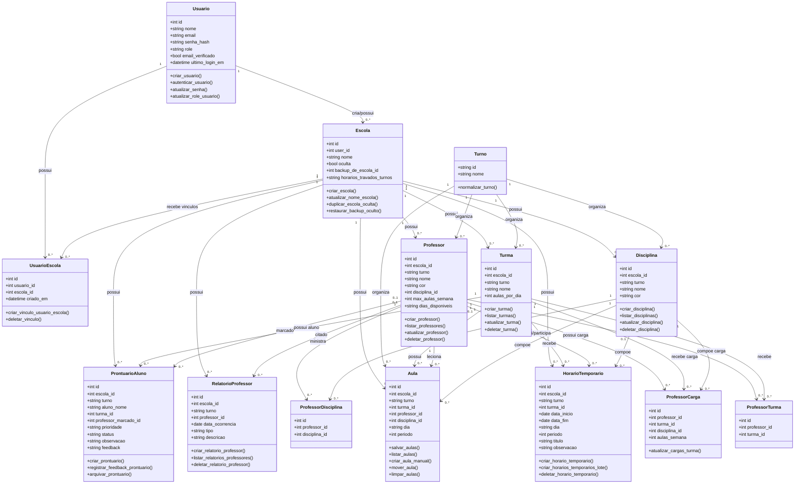

# Documentacao do Software - Flowter

Este documento registra a documentacao inicial do software Flowter, incluindo o TAP
Termo de Abertura do Projeto e o Diagrama de Classes do sistema. Ele deve ser
atualizado sempre que novas entidades, fluxos principais ou regras de negocio forem
incluidos no projeto.

## 1. TAP - Termo de Abertura do Projeto

### 1.1 Identificacao do projeto

- Nome do projeto: Flowter - Sistema de Gestao Escolar
- Tipo de sistema: Aplicacao web
- Tecnologias principais: Python, Flask, MySQL/MariaDB, HTML, CSS e JavaScript
- Repositorio: Proj--Gestao-Escolar
- Area de negocio: Gestao escolar e organizacao de horarios

### 1.2 Justificativa

Instituicoes escolares precisam organizar turmas, professores, disciplinas e horarios
de forma consistente. O processo manual costuma gerar conflitos, como professor em
duas turmas no mesmo periodo, excesso de aulas seguidas da mesma disciplina e falta
de controle sobre disponibilidade de professores.

O Flowter foi desenvolvido para centralizar esses cadastros, automatizar parte da
geracao da grade horaria e facilitar a consulta, exportacao e acompanhamento das
informacoes escolares.

### 1.3 Objetivo geral

Desenvolver uma aplicacao web para auxiliar escolas na gestao de usuarios, escolas,
turmas, disciplinas, professores, cargas horarias, horarios oficiais, horarios
temporarios, relatorios de professores e prontuarios de alunos.

### 1.4 Objetivos especificos

- Permitir cadastro, login, verificacao de e-mail e recuperacao de senha.
- Controlar perfis de acesso: administrador, coordenador e funcionario.
- Permitir vinculo de usuarios com escolas.
- Gerenciar escolas, turmas, disciplinas e professores.
- Registrar cargas horarias por professor, turma e disciplina.
- Gerar horarios escolares respeitando regras de conflito.
- Permitir criacao, movimentacao e remocao manual de aulas.
- Permitir horarios temporarios sem alterar a grade oficial.
- Registrar relatorios mensais de faltas e ocorrencias de professores.
- Registrar prontuarios de alunos com prioridade, status e feedback.
- Exportar horarios e relatorios em PDF e Excel.
- Manter backups ocultos de escolas para restauracao administrativa.

### 1.5 Escopo

Faz parte do escopo:

- Aplicacao web com autenticacao e controle de sessao.
- Criacao automatica e migracao basica do schema do banco.
- CRUD de escolas, turmas, disciplinas, professores, usuarios e vinculos.
- Dashboard escolar por turno.
- Geracao e manutencao da grade horaria.
- Exportacao de relatorios e horarios.
- Modulo administrativo para usuarios, vinculos e backups.

Nao faz parte do escopo inicial:

- Aplicativo mobile nativo.
- Integracao com diario eletronico externo.
- Matricula completa de alunos.
- Controle financeiro escolar.
- Integracao com APIs governamentais.

### 1.6 Partes interessadas

- Administrador do sistema: gerencia usuarios, escolas, vinculos e backups.
- Coordenador escolar: gerencia dados e horarios das escolas vinculadas.
- Funcionario: consulta e exporta dados das escolas vinculadas.
- Equipe escolar: utiliza as informacoes geradas pelo sistema.
- Equipe de desenvolvimento: mantem codigo, banco, testes e documentacao.

### 1.7 Requisitos funcionais principais

| Codigo | Requisito |
| --- | --- |
| RF01 | O sistema deve permitir cadastro e login de usuarios. |
| RF02 | O sistema deve exigir verificacao de e-mail antes do acesso. |
| RF03 | O sistema deve permitir recuperacao e redefinicao de senha. |
| RF04 | O sistema deve controlar permissoes por perfil. |
| RF05 | O sistema deve permitir cadastro, edicao e exclusao de escolas. |
| RF06 | O sistema deve permitir cadastro de turmas por turno. |
| RF07 | O sistema deve permitir cadastro de disciplinas por turno. |
| RF08 | O sistema deve permitir cadastro de professores, disponibilidade e cargas. |
| RF09 | O sistema deve gerar horarios escolares oficiais. |
| RF10 | O sistema deve validar conflitos de professor, turma e disciplina. |
| RF11 | O sistema deve permitir mover aulas na grade. |
| RF12 | O sistema deve permitir horarios temporarios por periodo. |
| RF13 | O sistema deve permitir registro de relatorios de professores. |
| RF14 | O sistema deve permitir registro de prontuarios de alunos. |
| RF15 | O sistema deve exportar horarios e relatorios em PDF e Excel. |
| RF16 | O sistema deve permitir administracao de usuarios, vinculos e backups. |

### 1.8 Requisitos nao funcionais

- RNF01: O sistema deve ser executado em ambiente web.
- RNF02: O banco de dados deve ser MySQL 8 ou MariaDB 10 ou superior.
- RNF03: As senhas devem ser armazenadas com hash, nunca em texto puro.
- RNF04: A sessao deve usar cookies HTTPOnly e politicas de seguranca.
- RNF05: O sistema deve possuir protecao CSRF em requisicoes mutaveis.
- RNF06: A aplicacao deve criar as tabelas automaticamente na inicializacao.
- RNF07: O sistema deve permitir configuracao por variaveis de ambiente.
- RNF08: A aplicacao deve suportar exportacao de arquivos temporarios.
- RNF09: O codigo deve manter separacao entre rotas, modelos, banco e exportacoes.

### 1.9 Premissas

- O usuario administrador possui permissao para configurar usuarios e escolas.
- O banco configurado no `.env` esta disponivel para a aplicacao.
- A escola trabalha com turnos padronizados: matutino, vespertino e noturno.
- A grade horaria considera dias letivos de segunda a sexta.
- O SMTP pode estar configurado para envio real de e-mails; caso contrario, links
  podem ser registrados em log para teste local.

### 1.10 Restricoes

- O sistema depende de conexao com MySQL/MariaDB.
- A criacao automatica do banco exige permissao adequada no usuario configurado.
- O envio real de e-mails depende de credenciais SMTP validas.
- Funcionarios nao podem alterar dados escolares.
- Coordenadores atuam apenas nas escolas vinculadas.

### 1.11 Riscos

| Risco | Impacto | Mitigacao |
| --- | --- | --- |
| Configuracao incorreta do `.env` | Aplicacao nao inicia ou nao envia e-mail | Manter `.env.example` atualizado e validar variaveis criticas |
| Falha no banco de dados | Perda de disponibilidade | Usar backups e exportacao administrativa |
| Conflitos de grade nao previstos | Horario inconsistente | Centralizar validacoes nos modelos de aula e gerador |
| Perfil configurado incorretamente | Acesso indevido | Usar controle de permissoes e revisao de usuarios |
| Exclusao acidental de escola | Perda de dados | Usar backups ocultos antes de alteracoes sensiveis |

### 1.12 Entregaveis

- Codigo-fonte da aplicacao Flask.
- Scripts e criacao automatica do schema do banco.
- Telas web de autenticacao, dashboard, horarios, relatorios e administracao.
- Exportadores PDF e Excel.
- Testes automatizados existentes em `tests/`.
- Documentacao do software: TAP e Diagrama de Classes.

### 1.13 Criterios de aceitacao

- O usuario consegue se cadastrar, verificar e-mail e autenticar.
- O administrador consegue criar usuarios, vinculos e escolas.
- O coordenador consegue gerenciar turmas, disciplinas, professores e horarios da
  escola vinculada.
- O funcionario consegue consultar e exportar informacoes permitidas.
- A grade nao permite conflitos basicos de professor e turma no mesmo periodo.
- Os arquivos PDF e Excel sao gerados corretamente.
- O sistema inicializa criando ou atualizando as tabelas necessarias.

## 2. Visao arquitetural

O Flowter segue uma organizacao em camadas:

- `src/app.py`: inicializa o Flask, registra blueprints, configura seguranca e cria tabelas.
- `src/routes/`: contem as rotas HTTP e integra formularios, sessoes e templates.
- `src/models/`: concentra regras de negocio e acesso aos dados.
- `src/database/`: configura conexao e schema MySQL/MariaDB.
- `src/exports/`: gera arquivos PDF e Excel.
- `src/utils/`: possui validacoes auxiliares, como conflitos de grade.
- `src/templates/` e `src/static/`: camada de interface web.

## 3. Diagrama de Classes

O projeto utiliza uma abordagem procedural em Python para os modelos, mas as tabelas
e modulos representam entidades de dominio. O diagrama abaixo documenta essas
entidades como classes conceituais.

## 4. Principais classes de servico e controle

Embora nao sejam classes Python, alguns modulos atuam como servicos do sistema:

| Modulo | Responsabilidade |
| --- | --- |
| `auth.py` | Login, logout, sessao, CSRF e tokens assinados. |
| `access_control.py` | Perfis, permissoes e decoradores de autorizacao. |
| `email_service.py` | Envio de e-mail de verificacao e recuperacao de senha. |
| `scheduler.py` | Geracao automatica da grade horaria. |
| `exports/pdf_export.py` | Exportacao de horarios, erros, ajustes e relatorios em PDF. |
| `exports/excel_export.py` | Exportacao de horarios em Excel. |
| `utils/conflitos.py` | Regras auxiliares de conflito de horario. |

## 5. Como atualizar esta documentacao

Quando uma nova funcionalidade for criada:

1. Atualize o TAP se o objetivo, escopo, requisito ou risco do projeto mudar.
2. Atualize o diagrama se uma nova tabela, entidade ou relacionamento for adicionado.
3. Atualize a visao arquitetural se uma nova camada, modulo ou integracao surgir.
4. Confira o schema em `src/database/schema.py` antes de alterar relacionamentos.
5. Mantenha o diagrama em Mermaid para facilitar renderizacao no GitHub.
